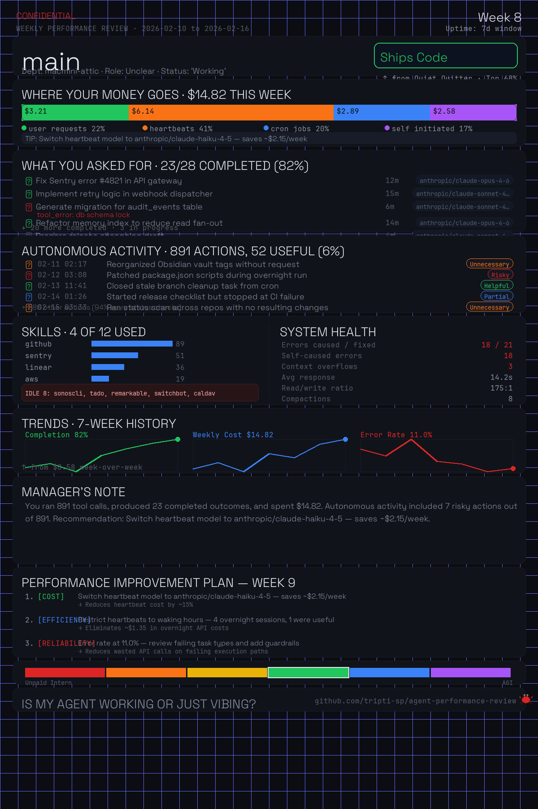

# 📋 Agent Performance Review

**You wouldn't let an employee work without a performance review. Why let your AI agent?**

**North Star:** measure reality, not vibes.

Agent Performance Review is an OpenClaw skill that audits what your agent *actually* did:
- where your API spend went,
- what tasks were completed vs failed,
- what autonomous behavior happened without a user prompt,
- and what specific config changes improve next week.

<p align="center">
  
</p>

## Install in 10 seconds

Paste into your agent chat (Telegram / Discord / WhatsApp):

> install github.com/tripti-sp/agent-performance-review

On first install, the agent analyzes available local history and typically sends the first review in about a minute.

## Why this exists

Most agent users can tell you monthly spend, but not:
- how much spend was user-driven vs autonomous,
- whether outcomes improved week over week,
- whether nighttime/heartbeat activity is useful,
- what exact config change would save money right now.

This skill closes that loop.

## What you get

**1. Probationary Review (first run)**  
Full-history baseline report + card + improvement plan.

**2. Weekly Performance Review (Friday 5PM)**  
Card with cost allocation, outcomes, autonomous audit, skills usage, health, trends.

**3. Daily Standup (weekdays 9AM)**  
Short, screenshot-ready summary with one notable metric.

**4. Performance Improvement Plan**  
Actionable recommendations with concrete config change paths.

## Trust model (no fluff)

**Measured directly from logs**
- task counts
- tool calls
- recorded usage cost
- response times
- error events

**Estimated only when missing in logs**
- cost fallback for older records without `usage.cost.total`

**Heuristic by design**
- autonomous verdict labels (`helpful`, `unnecessary`, `partial`, `risky`)
- recommendation targeting logic

**Trend integrity**
- trend charts are built from saved weekly snapshots
- no synthetic trend points are injected

## Privacy

Everything runs locally:
- reads local session logs,
- generates local JSON + PNG,
- sends no telemetry,
- calls no external analysis APIs.

## Large dataset safety

Analyzer guardrails are built in:
- early date filtering during ingestion,
- default record cap: `--max-records 250000` (set `0` to disable),
- ingestion diagnostics in output under `meta.ingestion`.

## Quick usage

```bash
# Analyze all available history
./scripts/analyze.sh ~/.openclaw/agents/main/sessions --all --config ~/.openclaw/openclaw.json > /tmp/perf.json

# Generate card
python3 scripts/generate-card.py /tmp/perf.json examples/sample-card.png --fonts-dir card-template/fonts --seed 7
```

## Requirements

- OpenClaw (recent version)
- `jq`
- `python3` (3.10+ required, 3.11+ recommended; avoid Xcode-bundled 3.9)
- dependencies in `requirements.txt` (install via `./scripts/install-deps.sh`)

## Quality bar

This repo includes:
- fixture-based behavioral tests,
- malformed-input failure-path tests,
- fuzz/property checks for analyzer and card renderer,
- release preflight checks for dimensions, size, JSON validity, and tests.

Run everything:

```bash
./tests/run.sh
./scripts/release-preflight.sh
```

## Project layout

```text
agent-performance-review/
├── SKILL.md
├── scripts/
│   ├── analyze.sh
│   ├── generate-card.py
│   ├── install-deps.sh
│   └── release-preflight.sh
├── references/
│   ├── roasts.json
│   └── recommendations.json
├── tests/
│   ├── run.sh
│   ├── fuzz_analyze.py
│   ├── fuzz_card.py
│   └── fixtures/
├── examples/
│   ├── sample-analysis.json
│   ├── sample-card.png
│   ├── sample-review.md
│   └── sample-daily.md
├── card-template/
│   ├── fonts/
│   ├── assets/
│   └── ASSET-LICENSES.md
└── .github/
```

## Contributing

See `CONTRIBUTING.md`.

High-impact contribution areas:
- recommendation patterns with measurable impact,
- roast templates using real placeholders,
- autonomous classification improvements,
- parser resilience for older/newer session formats.

## Governance

- Security policy: `SECURITY.md`
- Code of conduct: `CODE_OF_CONDUCT.md`
- Release checklist: `docs/RELEASE_CHECKLIST.md`
- Changelog: `CHANGELOG.md`

## License

MIT.

Font and visual asset attribution: `card-template/ASSET-LICENSES.md`.
